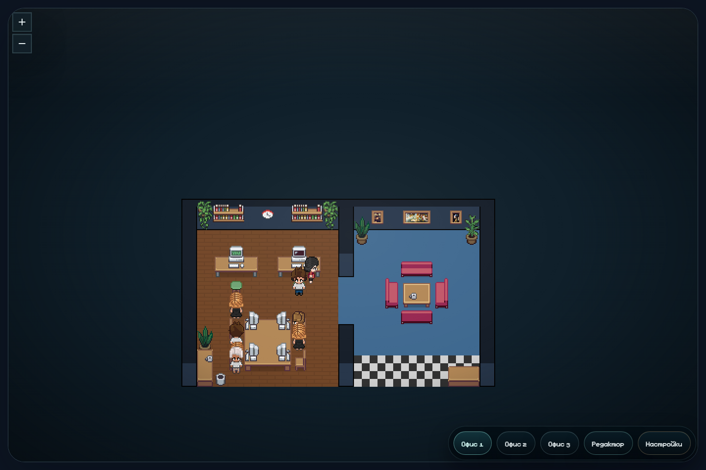
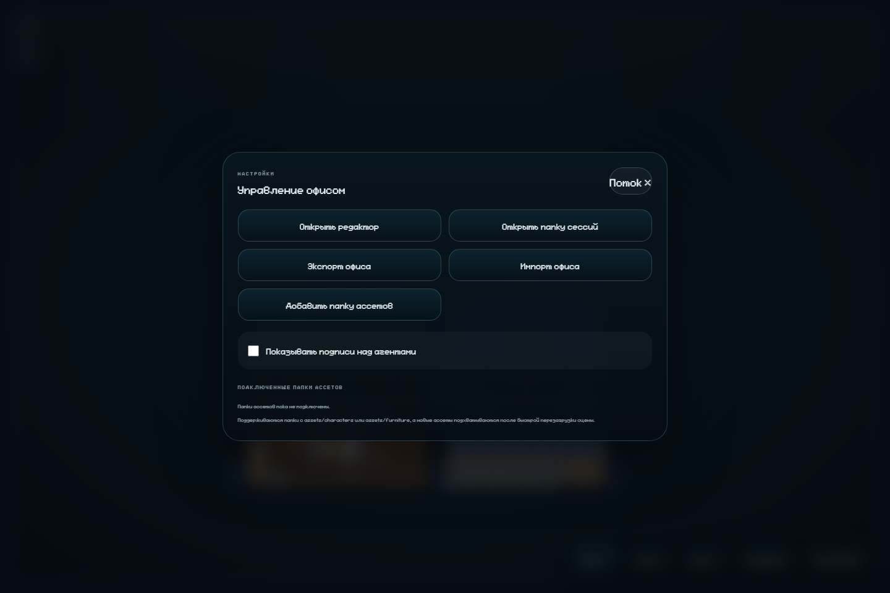
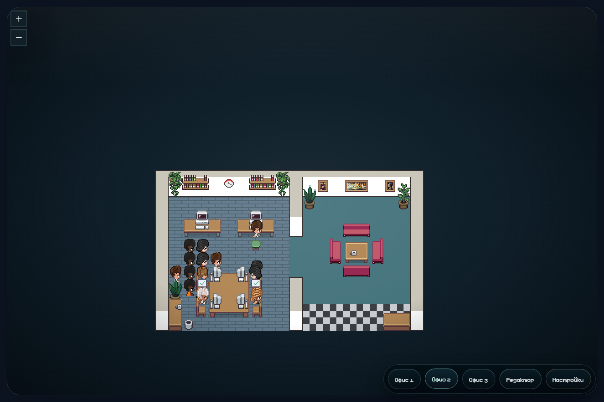

# Santiya Pixel Agents Desktop

Santiya Pixel Agents Desktop is a Windows desktop app that turns live Codex threads into a shared pixel-office workspace.

The app presents active threads as office workers inside a live office scene, supports multiple office presets, includes a built-in office editor, and allows importing layouts plus adding custom character and furniture asset packs.

## Highlights

- Live office view for active Codex threads
- Office presets with a shared command-center workflow
- Built-in office editor
- Import and export for office layouts
- External asset-pack support for characters and furniture
- Packaged Windows installer release

## Repository Layout

- `app-runtime/` — packaged app runtime code used by the desktop build
- `installer/` — Inno Setup installer scripts
- `screenshots/` — release screenshots for the GitHub page

## Screenshots

### Main Office

### Settings

### Office Preset 2

## Release

The tested Windows installer for the current release is:

- `Pixel Agents Desktop Setup 0.1.2.exe`
- SHA256: `7D4BECFAA8129DEB5FBCADF9567769C4A656005A5F803CF113BB9302D6223708`

The installer should be uploaded to GitHub Releases as a release asset rather than committed into the repository history.

## Version 0.1.2

Version `0.1.2` includes:

- verified installer rebuild after a broken `0.1.1` artifact
- stricter installer build validation
- safer external asset path handling
- office layout storage hardening
- validated office import/export flows
- tested external asset-pack support
